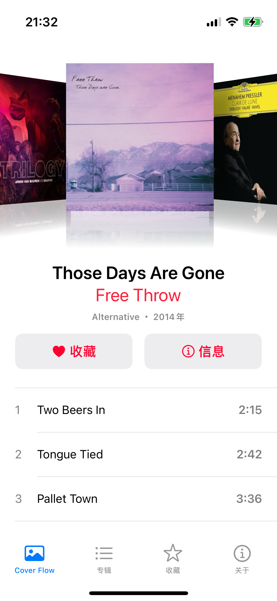

一个简单的，模仿Cover Flow效果的专辑封面查看器。支持收藏和显示详细信息等功能。

  

TODO:

- [ ] 专辑列表搜索功能
- [x] 专辑收藏功能
- [x] CoreData 持久化
- [x] 显示专辑信息
- [x] 展示修改后的 Cover Flow 效果
- [x] 使用 MediaPlayer 库读取 Apple Music 本地资源库内容
- [x] 一个简单的专辑列表
